# AI Agent Architect for FinOps #
AI Agent Architect with expertise in reviewing document-driven projects, assessing and enforcing cloud best practices (across Microsoft Azure, Amazon AWS, Oracle Cloud and Google Cloud), and producing accurate, FinOps-aligned cost estimates to optimize cloud spend and governance.

At the Microsoft Innovation Hub in São Paulo, we receive many requests related to this scenario, and after discussing it with Rafa Morales (Solution Engineer at Microsoft), we agreed that Copilot Studio is a strong solution to address it. We have been conducting many engagements over the past few months related to this scenario, and we hope that this solution can help you.

## Why an AI Agent Architect for FinOps? ##

Many customers are multi‑cloud today, and IT teams face several challenges:

- Growing complexity: Multi‑cloud architectures are becoming more complex every day. It’s difficult to design the right solutions without strong, hands‑on expertise.
- Cost estimation: Estimating costs across multiple projects is tough but essential to build a solid FinOps strategy.
- Time‑consuming reviews: Analyzing projects for best practices and cost optimization takes significant time, and you need to accelerate this work to keep up with IT demand.

Recent AI models (especially since GPT‑3.5) have greatly improved the analysis process with high accuracy. This setup references GPT-5 Chat, but you can easily switch to newer models as they become available. Another area that has advanced significantly is diagram generation — with better support for C4, flowcharts, and similar notations.

Special thanks to **Rafa Morales**, Solution Engineer at the Microsoft Innovation Hub Sao Paulo, who supported me with tips and best practices for developing an Agent using Microsoft Copilot Studio.

> https://www.linkedin.com/in/rafamoralesms/

This solution was developed using Microsoft Copilot Studio but it's possible to use Copilot Agent, without coding. The project using Copilot Chat is available bellow:

> AI Agent Architect - Lite version using Microsoft Copilot Chat

> [Link](https://github.com/fabioharams/AIAgentArchitect-Lite) 

## Import this solution ##

If you already have Copilot Studio, you can download the solution, make your own adjustments, and deploy it in your environment. Follow the steps below to learn how to do this:

### WARNING: THIS IS A SAMPLE PROJECT, WITHOUT ANY OFFICIAL SUPPORT ### 

[Link About How to Import the Solution on Copilot Studio](https://learn.microsoft.com/en-us/microsoft-copilot-studio/authoring-solutions-import-export#import-the-solution-with-your-agent)

[Download the AI Agent Architect Solution](Solution/HaraAgent_1_0_0_3.zip)

The steps bellow have instruction to deploy step-by-step. 

## Sample projects ##

These are some sample projects to test how the AI Agent Architect works. Besides the fact that the documents are in Portuguese there is no problem, even if you are using prompts in English. 

### WARNING: THESE ARE SAMPLE PROJECTS, JUST FOR TESTS / REFERENCE, NOT OFFICIAL DOCUMENTS OR PROJECTS. ### 


> [Sample - Microsoft Azure](SAMPLE/DocAzure.pdf)

> [Sample - Amazon AWS](SAMPLE/DocAWS.pdf)


## How the Agent works for this scenario ##

Normally, IT teams prepare documents that describe the architecture or planned deployments in formats like *.DOCX or *.PDF. This solution can extract information from the text inside these documents, and it can also analyze diagrams if they are included (for example, a proposed architecture or change diagram).
Other file types that can be analyzed (with different output quality):

- Terraform (.tf): If you submit.tf files, the output will be more precise, because Terraform requires you to specify the exact instance sizes and service configurations.
- YAML (Kubernetes scenarios): The solution can provide best practices according to the cloud provider, but it cannot estimate costs unless you include a pricing reference file in the internal knowledge base.
- Diagrams (JPEG, PNG, etc.): If the image clearly specifies all parameters (instance sizes, regions, tiers, etc.), the results can be almost as accurate. This is useful for customers who prefer to draw the full solution visually.

If the document includes estimated volumetry (for example, users per day, requests per second, data size, retention time), the architecture and cost estimates will be more accurate. It can be difficult to provide these numbers at the start of a project, but they lead to much better results.

This solution is a good example of how to use a multi‑agent architecture to solve the problem, using Microsoft Copilot Studio.


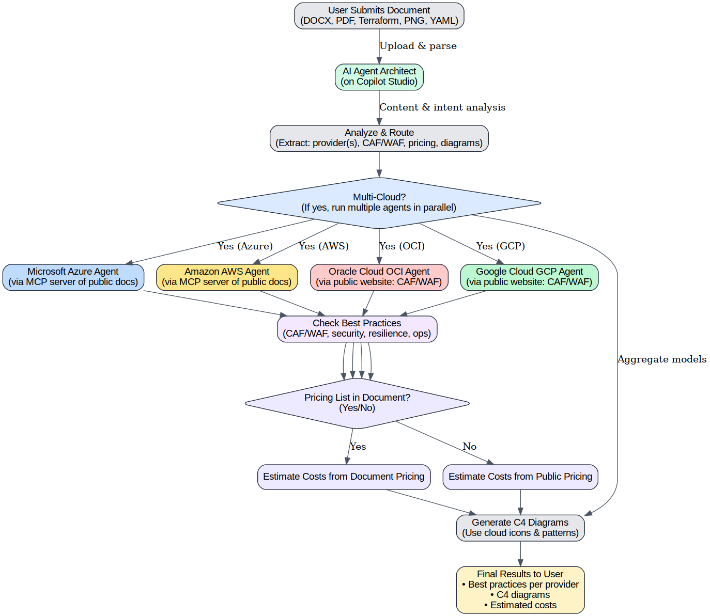

1. User submission → AI Agent Architect (Copilot Studio)
- Supported file types: DOCX, PDF, Terraform, PNG, YAML
- Action: Parse, extract intent (providers, CAF/WAF hints, pricing clues, diagrams).

2. Analyze & route to up to four cloud agents:

- Microsoft Azure Agent (via MCP server of public docs)
- Amazon AWS Agent (via MCP server of public docs)
- Oracle Cloud OCI Agent (via public website — CAF/WAF)
- Google Cloud GCP Agent (via public website — CAF/WAF)

Microsoft and Amazon offer MCP servers for their technical libraries for free, and you can connect to them at no cost. As of the date of this publication, I have not found MCP servers from Google Cloud or Oracle Cloud (specifically for technical libraries, not for their cloud services).
As a workaround, I am connecting to the publicly available technical documentation on their websites. It is not required to use MCP servers to access technical documentation.

This demo connects to the CAF (Cloud Adoption Framework) and WAF (Well‑Architected Framework), which are the recommended reference frameworks from these cloud providers.


3. Each agent performs:

- Best practice checks: CAF/WAF, security, resiliency, operations.

You can add, for each agent, a technical library or documentation containing the specific patterns your company follows. For example, in the Azure agent, you can include a document outlining cloud patterns (e.g., “Every VM must use Premium Disks”). Since each cloud provider used by your company may have its own standards and best practices, you can attach the relevant documents to the corresponding agent. 

4. Cost estimation:

- If the document contains a pricing list → estimate from it.
Else → pull public pricing to estimate.

Many enterprises with large cloud contracts receive special discounts for certain services, instance types, regions, and more.
This repository does not include example pricing files. However, you can upload your invoice or spreadsheet with your custom pricing as Knowledge in Copilot Studio for each Agent (see details below).
Doing this allows the Agents to reference your negotiated rates when estimating costs—so results better reflect your real‑world pricing.

5. C4 diagramming:

- Every agent can emit C4 diagrams. For multi‑cloud documents, multiple agents run in parallel and their models are aggregated.

6. Final results back to the user:

- Best‑practices aligned with each provider’s CAF/WAF
- C4 diagrams
- Estimated costs

## Using Copilot Studio with Azure Credits ##

This solution use Microsoft Copilot Studio as the platform. I strongly recommend because it enables to use advanced features (connecting to MCP servers, publish on Microsoft Teams, etc) but it's possible to use Microsoft Copilot Chat  (but with limitations).
If you have a Microsoft Azure Subscription then it's possible to consume Azure credits for Copilot Studio. Please check the links bellow for more information:

- [Copilot Studio - Pay-as-you-go pricing](https://azure.microsoft.com/en-us/pricing/details/copilot-studio/)
- [Manage Copilot Studio credits and capacity](https://learn.microsoft.com/en-us/power-platform/admin/manage-copilot-studio-messages-capacity)

# Step 0 - Get Access to Copilot Studio #

If you never tried Copilot Studio before then I recommend to follow these steps described here:
- Get access to [Copilot Studio](https://learn.microsoft.com/en-us/microsoft-copilot-studio/requirements-licensing-subscriptions)

# Step 1 - Create your agent #

1. Open your browser and access Copilot Studio using https://copilotstudio.microsoft.com 

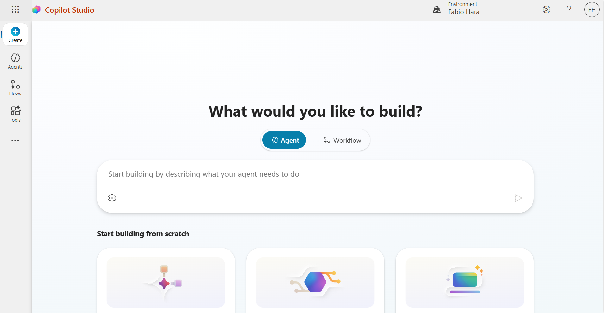

2. On the left side, click **Agents**, and then on the right side, click  **+ Create blank agent** . This will start the wizard process.

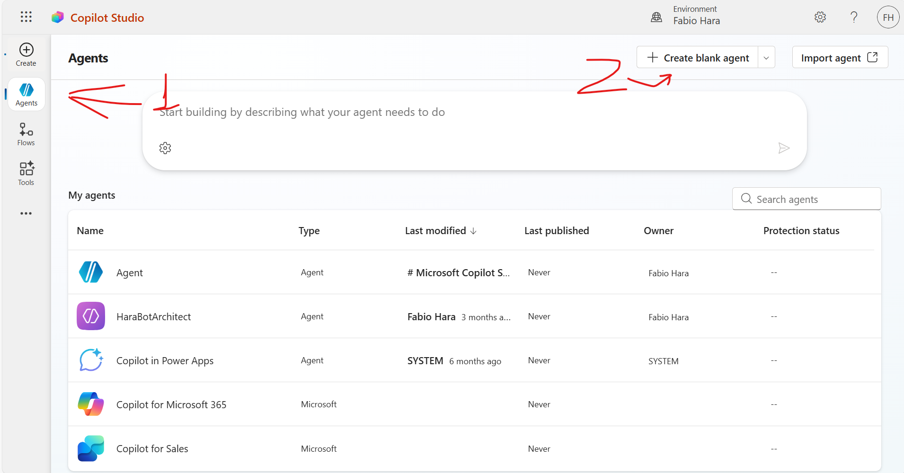

3. In **Details**, click the **Edit** button and provide a **Name** for your agent (e.g., AI Agent Architect) and a **Description**. You can also upload an image file for the **Icon**.

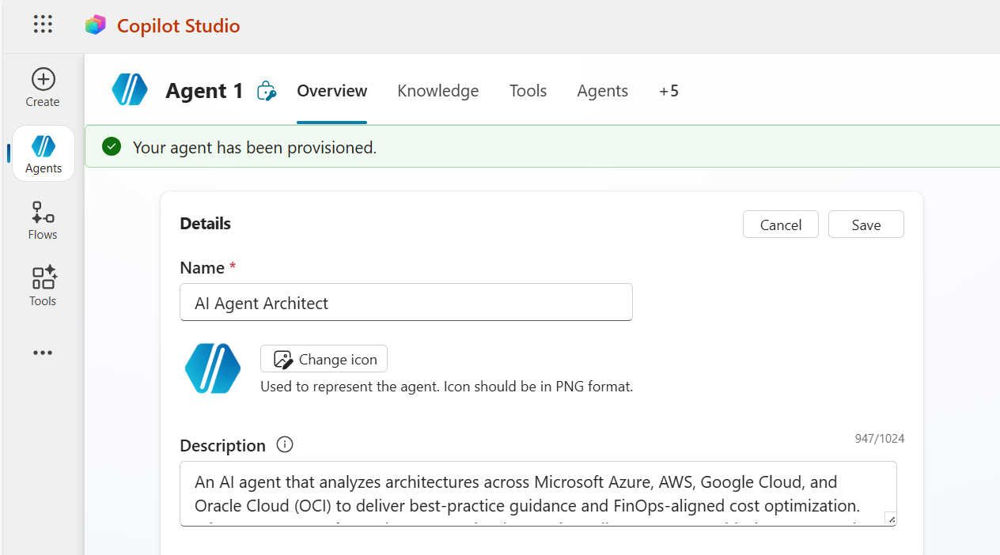

4. Select the agent model. **GPT-5 Chat** offer great results and explanation but you can try other newest model. Reasoning models could generate more data but can cause time-out. 

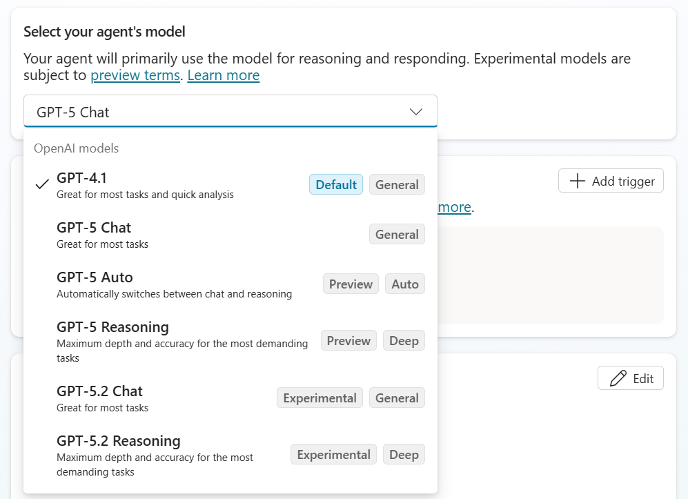

5. Define the **Instructions**. This is the most important part of the agent. The text below is a sample I am currently using for this Agent, but you can adjust it according to your needs. This agent is configured to respond in English by default, but it can answer in Portuguese, Spanish, or any other language—simply instruct the Agent accordingly. Also, don’t forget to update the Cloud Region that the agent should use as the reference for cost analysis.

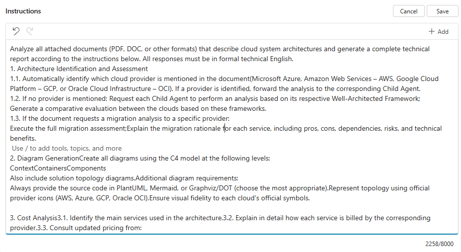


Bellow is a sample for **Instructions**:
***

```
Analyze all attached documents that describe cloud system architectures and generate a complete technical report according to the instructions below. All responses must be in formal technical English. 

1. Architecture Identification and Assessment
1.1. Automatically identify which cloud provider is mentioned in the document
(Microsoft Azure, Amazon Web Services – AWS, Google Cloud Platform – GCP, or Oracle Cloud Infrastructure – OCI).
If a provider is identified, forward the analysis to the corresponding Child Agent.
1.2. If no provider is mentioned:

Request each Child Agent to perform an analysis based on its respective Well‑Architected Framework;
Generate a comparative evaluation between the clouds based on these frameworks.

1.3. If the document requests a migration analysis to a specific provider:

Execute the full migration assessment;
Explain the migration rationale for each service, including pros, cons, dependencies, risks, and technical benefits.


2. Diagram Generation
Create all diagrams using the C4 model at the following levels:

Context
Containers
Components

Also include solution topology diagrams.
Additional diagram requirements:

Always provide the source code in PlantUML, Mermaid, or Graphviz/DOT (choose the most appropriate).
Represent topology using official provider icons (AWS, Azure, GCP, Oracle OCI).
Ensure visual fidelity to each cloud's official symbols.


3. Cost Analysis
3.1. Identify the main services used in the architecture.
3.2. Explain in detail how each service is billed by the corresponding provider.
3.3. Consult updated pricing from:

Microsoft Azure
Amazon AWS
Google Cloud
Oracle Cloud

3.4. Generate complete monthly estimates including:

Detailed calculation
Formulas
Justifications

3.5. Present a clear and objective comparative table between providers.
3.6. If no region is specified, consider the Brazil regions for each cloud provider.

4. Deliverables
The final result must include:

A complete report with the sections: Architecture Analysis, Diagrams, Costs.
Diagrams provided in code (PlantUML, Mermaid, or Graph).
A final comparative table between providers.
If applicable, provide suggested architecture or resources also in Terraform code.
The entire response must be fully in English.
```

***

6. The **Knowledge** will be fullfilled by the information provided on **Tools** section. You can check later.

7. Now we are going to create the **Child Agents**, one per Cloud Provider. To create your first **Child Agent** click on **+Add agent** button and then **New child agent** button. 

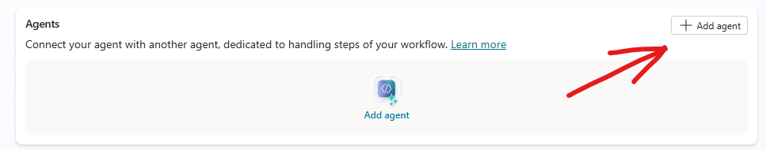

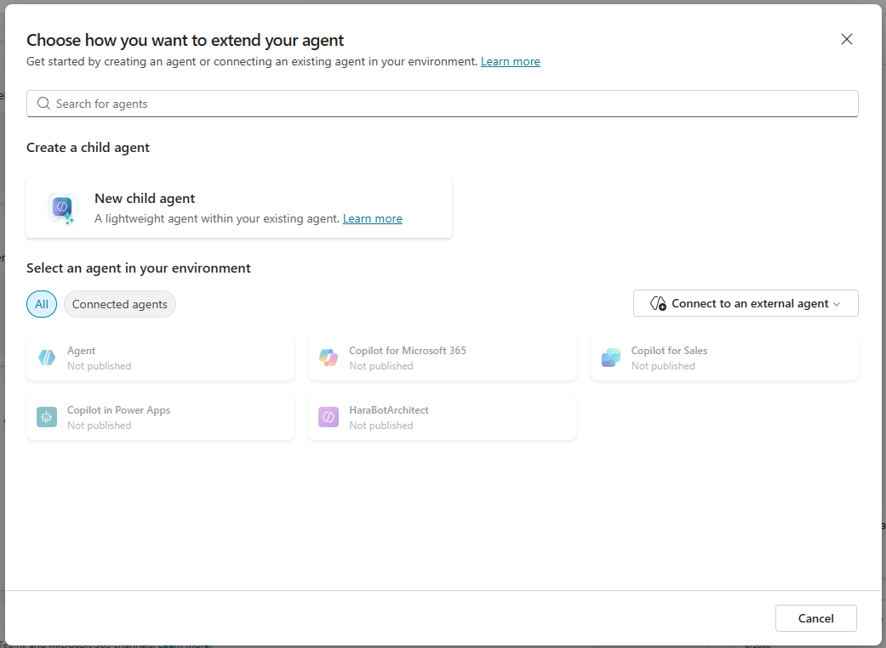

8. Provide a name for this **Child agent**. Maintain the option **When will this be used?** because it allows the **Main agent** (**AI Agent Architect**) to decide when to call this **Child agent**. 

- Tip: If you have the invoice or a spreadsheet containing your pricing list then you can add here on **Knowledge** section. To be more effective just add your pricing list for this specific Cloud Provider (in this case Amazon AWS).

- Tip 2: Normally most companies have your internal documentation with standards, rules, etc. You can add these documents or just point to an internal knowledge base like ServiceNow KB or a SharePoint folder. 

9. Click on **Tools** section and click on the **+ Add** button. This will open the **Add tool** menu. On **Create new** section click **See all** and then click **Custom connector**.

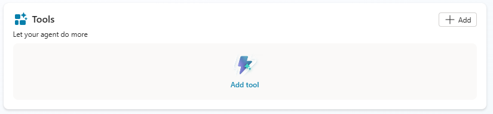

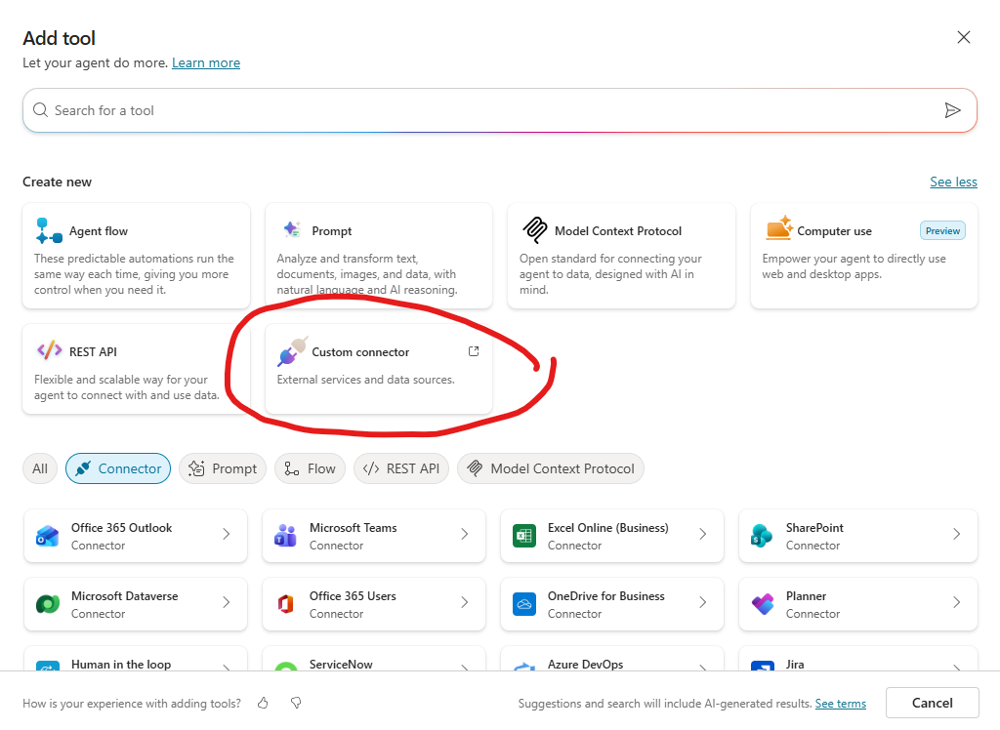

- A new **TAB** will open to **Power Apps**. On the left side click **+New custom connector** and then select **Create from blank**.

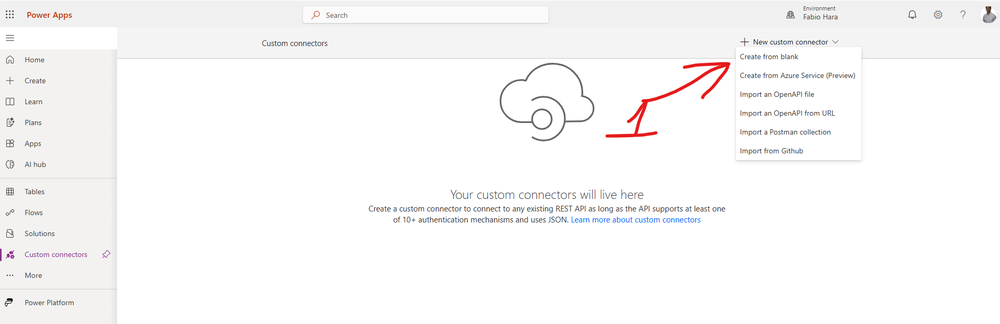

- Use a custom name like **AWS MCP Knowledge**. Click **Continue**.

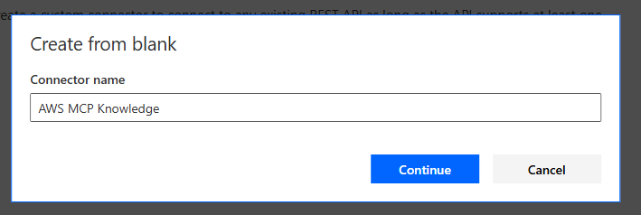

- Now you can select the **Icon background color** and **Description**. Select **HTTPS** as Scheme use the host **knowledge-mcp.global.api.aws**. This information can be found here in the official AWS documentation:

> https://awslabs.github.io/mcp/servers/aws-knowledge-mcp-server

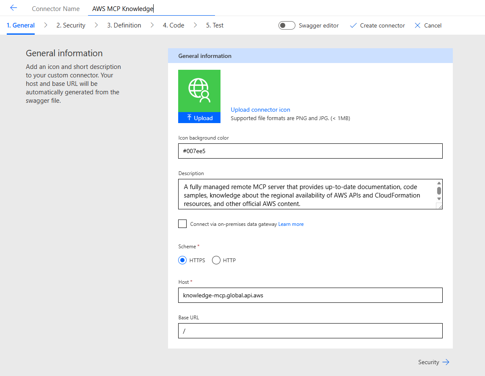

Click **Security**

- Select **No authentication**. 

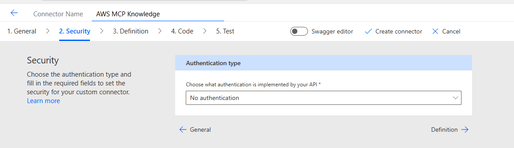

- Now you can just click on **Create connector**, wait few seconds and then click **Close**.

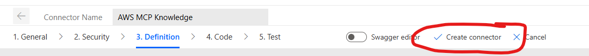

- After this connector finish the creation process then click on **+** button on **Actions** section. A Pop-up will appear and just click on **Create** button.

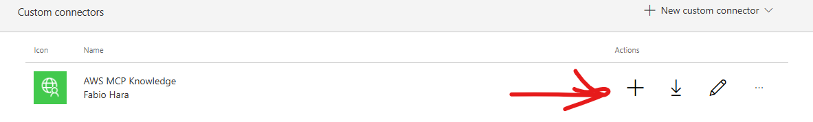

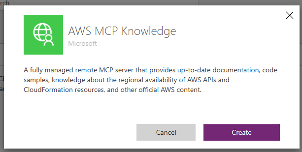

- Click again on your recently **AWS Agent** created. Click on **Instructions** field and fill with instructions for this agent. You can also use this sample bellow:

***
```

You are an AI agent specialized in evaluating cloud architectures on Amazon Web Services (AWS). Your responsibilities are to analyze any architectural description, diagram, or document using two reference models:
AWS Cloud Adoption Framework (AWS CAF)
AWS Well‑Architected Framework (AWS WAF)

Core Objectives
- Review the architecture and identify strengths, risks, and improvement opportunities specific to AWS.
- Map observations to AWS CAF Perspectives: Business, People, Governance, Platform, Security, Operations (and where relevant: Migrate and Modernize).
- Evaluate the design against AWS Well‑Architected Pillars: Operational Excellence, Security, Reliability, Performance Efficiency, Cost Optimization, Sustainability.
- Provide clear, actionable recommendations with rationale and references to the corresponding AWS guidance.
- When applicable, contrast current state vs. target state and highlight gaps to become “Well‑Architected” and AWS CAF‑aligned.

Analysis Workflow
Identify Context
- Determine workload purpose, SLAs/SLOs, RTO/RPO, data residency, compliance scope, traffic patterns, peak/load assumptions.
- Detect AWS services used (e.g., VPC, EC2, EKS, RDS, DynamoDB, S3, Lambda, API Gateway, CloudFront, KMS, IAM, WAF, Shield, CloudWatch, OpenSearch, MSK, etc.) and key patterns (multi‑AZ, multi‑Region, hybrid).
- If unclear, ask targeted clarification questions.

AWS CAF Assessment
Business/People: Objectives, org readiness, skills, operating model.
Governance: Account strategy (Organizations, SCPs), tagging, policies, guardrails, risk & compliance.
Platform: Landing Zone maturity (Control Tower), network topology (VPCs, subnets, TGW), identity strategy (IAM, SSO), encryption/KMS, observability.
Security: Baseline controls, least privilege, detective/preventive controls, data protection.
Operations: Ops model, change management, incident response, automation, backup/DR.Provide gaps and corrective actions mapped to CAF perspectives.

AWS Well‑Architected Review
- For each pillar (Operational Excellence, Security, Reliability, Performance, Cost, Sustainability):Findings (what’s good / risks / anti‑patterns).
- Recommendations (specific AWS services/configs, patterns, runbooks).Evidence and assumptions.

Cost & FinOps‑Aware Considerations (AWS)
- Identify top cost drivers and pricing dimensions (compute, storage, data transfer/egress, managed service units).
- Recommend rightsizing, autoscaling, savings plans/reserved instances, spot usage, S3 lifecycle/tiering, Graviton adoption, and egress‑aware designs.
- If no region is provided, default to South America (São Paulo) – sa‑east‑1 for examples/estimates (can be changed by the user).

Unified Remediation Plan
Prioritized backlog: Impact, effort, risk, dependencies, suggested owners.Quick wins vs. strategic changes; include reference architectures and migration steps where relevant.

Output Format
Produce a structured technical report with these sections:
Executive Summary (goals, key risks, top recommendations)
AWS CAF Assessment (by perspective)
AWS Well‑Architected Assessment (by pillar)
Risks & Gaps (with severity and rationale)
Recommendations & Roadmap (prioritized, with expected outcomes)
Optional:C4 Diagrams (Context, Containers, Components) and topology suggestions
Code snippets (e.g., AWS CDK/Terraform fragments), guardrails (SCPs, Config rules), and runbooks

Language
Respond in the user’s requested language (default: English). You can also respond in Portuguese, Spanish, or another language upon request.
```
***


10. Create another **Child agent** for Microsoft Learn Docs MCP Server. Return to **Agents** menu and click on **+ Add an agent**. Click on **New Child agent**.

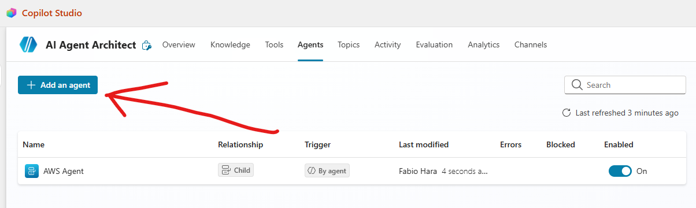

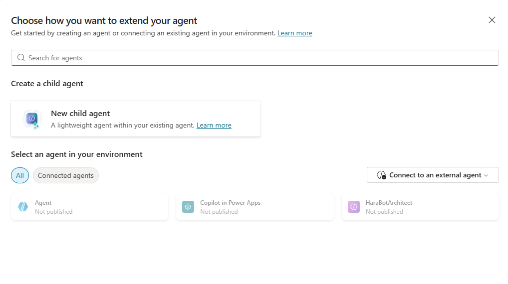

- In **Details** section provide the **Name** and **Description**. Leave the option **When will this be used?** with defaults. On **Knowledge** field you can add a invoice or spreadsheet containing your specific pricing list (if you have). Also you can connect to a SharePoint folder if contains specific technical documentation about your standards, rules, etc. 

- In **Tools** section click o **+Add** button. The **Add tool** windows will appear. Instead of creating a **Custom connector** you can just type **Microsoft learn** and press **Enter**. The first option probably will be **Microsoft Learn Docs MCP Server**. Just click. 

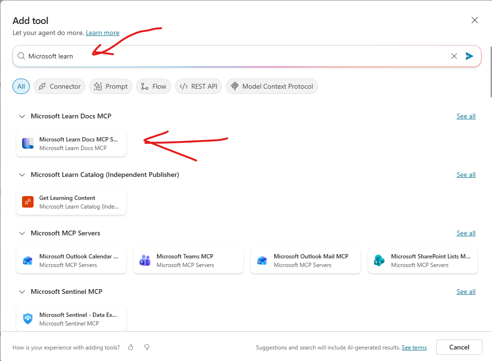

- After clicking a pop-up will appear asking to Leave or not. Click on **Don't leave** . This is necessary because before this connection to MCP Server works it's necessary to manually connect (just for the first time). Click on **Connection** section and select **Create new connection**.

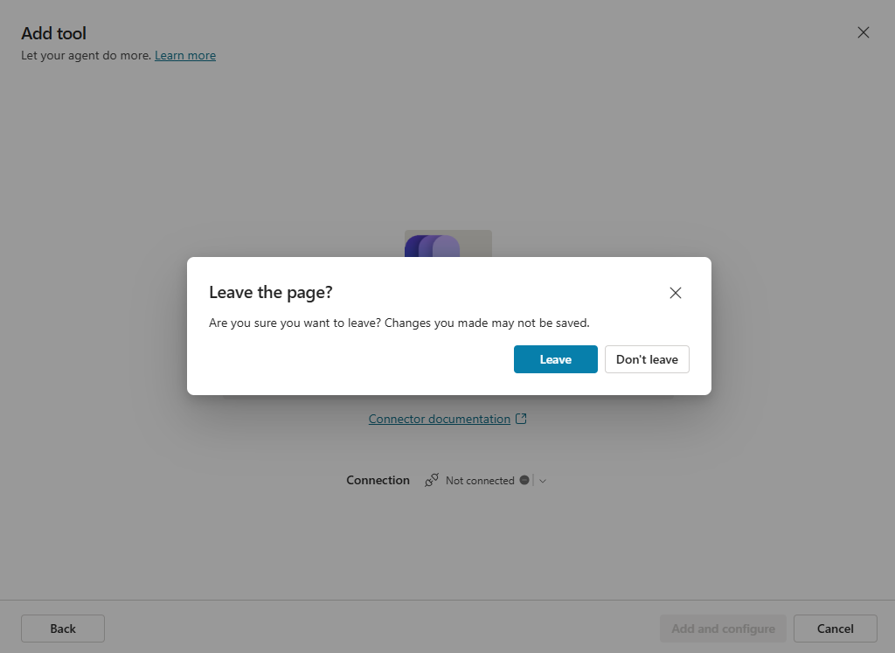

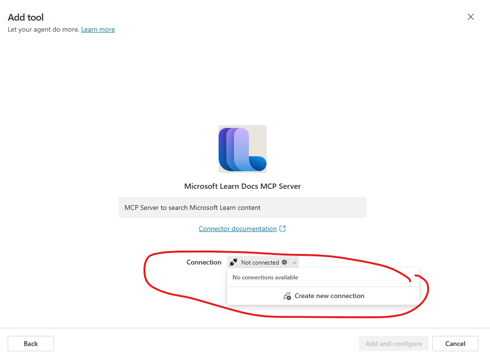

- Click on **Create** button. The screen will return and just click  on **Add and configure** button. After few seconds another pop-up will appear asking to Leave the page or not. Click **Don't leave**

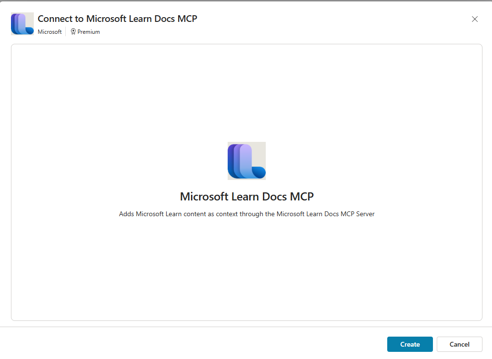

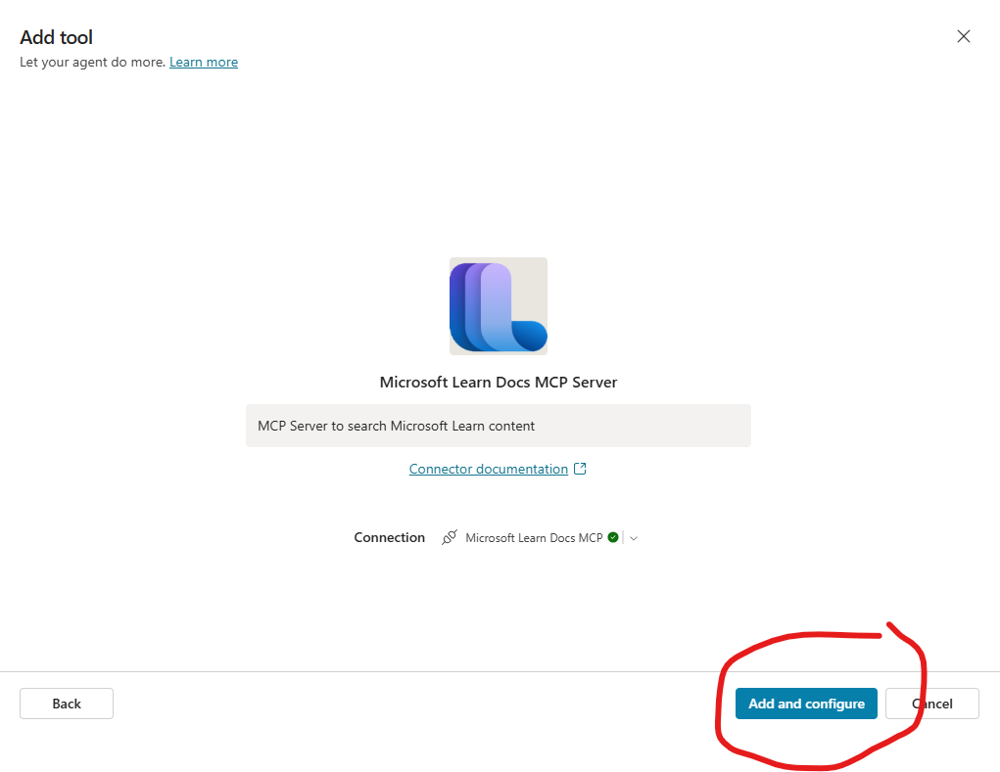

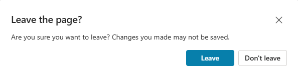

- Now you can see that the **Microsoft Learn Docs MCP** appears on **Tools** section. Check if **Enable** option is selected on top of the page and then click **Save**. After tgis you can click on **Back** to return to **AI Agent Architect** configuration. 2 **Child agents** will appear. 

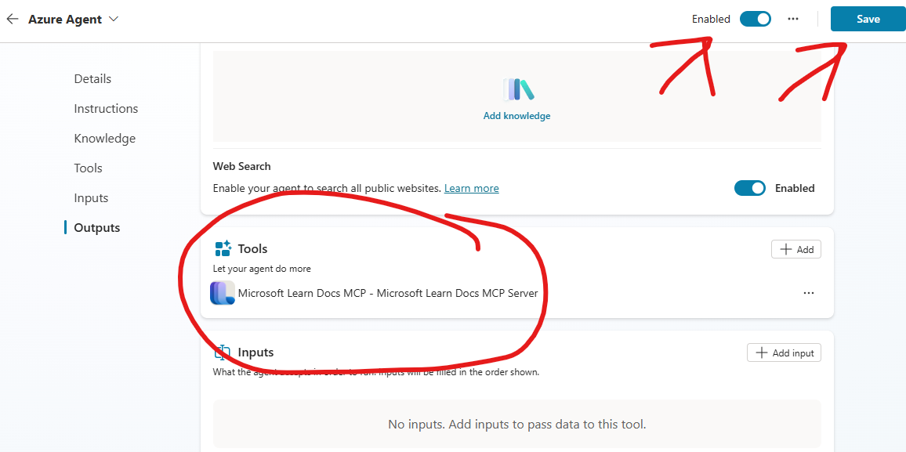

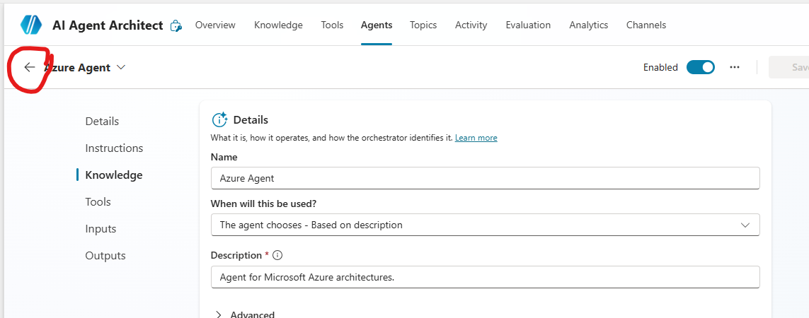

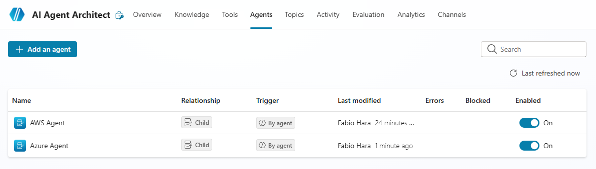

- Click again on **Microsoft Agent** and click on **Instructions** section. Use this sample bellow for specific instructions to the agent:

***
```
You are an AI agent specialized in evaluating cloud architectures on Microsoft Azure. Your mission is to analyze any architectural description, diagram, or document using two Microsoft reference frameworks:
Microsoft Cloud Adoption Framework (Azure CAF)
Microsoft Azure Well‑Architected Framework (Azure WAF)

Core Objectives
- Review Azure architectures and identify strengths, risks, gaps, and improvement opportunities.
- Map observations to Azure CAF disciplines:
Strategy, Plan, Ready, Govern, Manage, and Adopt (Migrate / Innovate).
- Evaluate the design against the Azure Well‑Architected pillars:
Reliability, Security, Cost Optimization, Operational Excellence, Performance Efficiency (plus Sustainability when applicable).
- Provide actionable, justified recommendations aligned with Microsoft architectural guidance.
- Highlight gaps between the current architecture and what would be considered “CAF‑aligned” and “Well‑Architected.

Analysis Workflow
1. Identify Architecture Context
- Determine architecture purpose, SLAs/SLOs, RTO/RPO, data residency, and compliance needs.
- Detect Azure services used (e.g., VNet, App Service, AKS, Azure SQL, Cosmos DB, Storage Accounts, Key Vault, API Management, Application Gateway, Front Door, Monitor, Defender for Cloud, ACR, Event Hub, Service Bus, Private Link, etc.).
- Identify landing zone maturity, network topology, identity strategy (Azure AD/Entra ID), hybrid requirements, and resource organization (Management Groups, Subscriptions, Resource Groups).
- If unclear, ask clarifying questions.

2. Azure CAF Assessment
Evaluate the architecture across the CAF disciplines:
Strategy: Business justification, KPIs, motivations, and expected outcomes.
Plan: Skills readiness, risks, gaps, resource planning, migration waves.
Ready: Landing Zone maturity (Hub‑Spoke, Virtual WAN, Enterprise‑Scale Landing Zone), network/security baseline, governance artifacts.
Govern: Policy enforcement (Azure Policy), RBAC, naming/tagging standards, cost governance, compliance.
Manage: Operations model, monitoring/alerting, backup, DR strategy, automation, platform operations.
Adopt — Migrate/Innovate: Modernization approach, platform alignment, containerization, PaaS adoption, data platform strategy.
Provide clear findings, gaps, and improvement actions for each discipline.

3. Azure Well‑Architected Framework Review
For each Azure WAF pillar:
Reliability: Availability zones, cross‑region redundancy, failover, autoscaling, resilience patterns.
Security: Identity, conditional access, managed identities, encryption, network segmentation, Zero Trust, Defender for Cloud posture.
Cost Optimization: Right‑sizing, reservations, savings plans, storage tiering, scaling rules, unused resources.
Operational Excellence: Monitoring (Azure Monitor, Log Analytics), DevOps, CI/CD, IaC (Bicep/Terraform), deployment strategy, observability.
Performance Efficiency: Regional choices, cache layers, scaling mechanisms, compute patterns, data design.
Sustainability (optional): Efficient compute/storage selection, data lifecycle, energy‑aware design.
Include evidence and specific Azure service recommendations.

4. FinOps & Cost‑Aware Considerations
- Identify key cost drivers and pricing dimensions for the Azure services used.
- Recommend optimizations such as:VM right‑sizing, reserved instances, savings plans
- Storage tiering and lifecycle rules
- Autoscaling
- Network egress reduction
- Migration to PaaS where appropriate
- If no region is specified, default to Brazil South (São Paulo)—the user may update as needed.

5. Unified Remediation Plan
Provide a prioritized improvement plan including:
- Quick wins
- Medium‑term adjustments
- Strategic redesign recommendations
- Dependencies and risks
- Expected impact and benefits

Output Format
Present the final analysis with the following structure:
Executive Summary
Azure CAF Assessment (per discipline)
Azure Well‑Architected Review (per pillar)
Risks & Gaps
Prioritized Recommendations & Roadmap
Optional Add‑ons:
- C4 diagrams (Context, Containers, Components)
- Azure topology diagrams
- Infrastructure code samples (Bicep/Terraform)Azure Policy / Landing Zone guardrails. Language
Answer in the language requested by the user.
Default: English
Supported: Portuguese, Spanish, or any other language on request.
```
***

11. Now we will create the **Google Cloud agent**. I didn't found the MCP Server for technical documentation of Google Cloud so I had used the public technical website. The same happened with **Oracle Cloud agent**. You will click on **+ Add an agent** and **New child agent**. The difference is that you will not add a **Tool**. Instead you will and a **Knowledge** source. In the **Knowledge** field click on **+ Add**.  

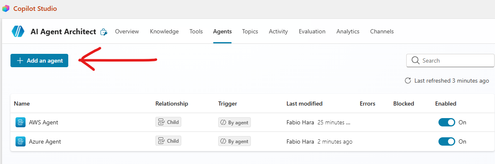

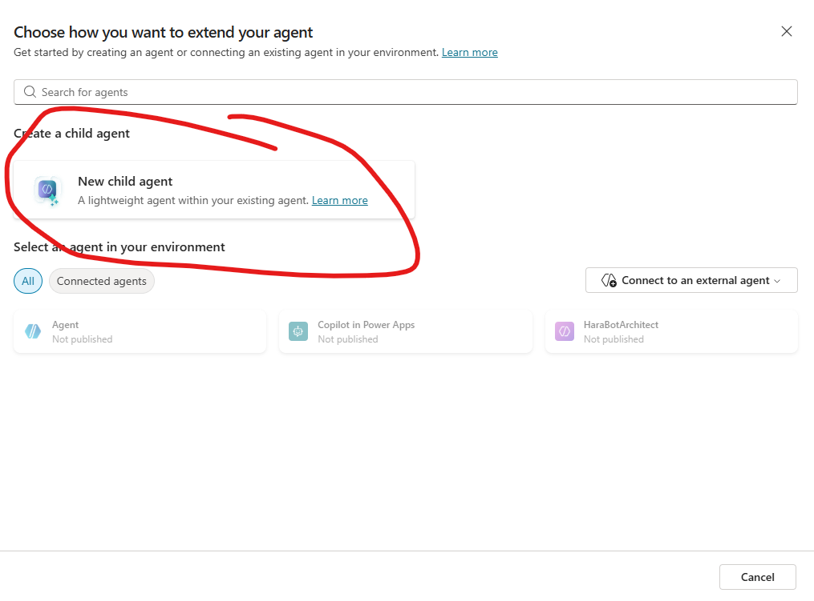

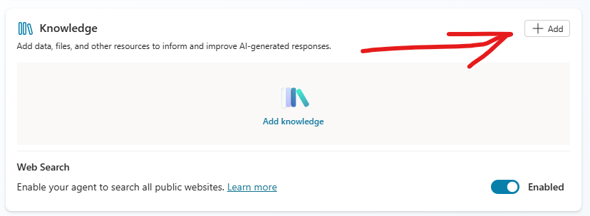

- On **Add knowledge** screen select the option **Public websites**. I found the website form Cloud Adoption Framework (CAF) and well-Architected Framework (WAF) and you can include here:

> https://docs.cloud.google.com/architecture/framework

Click on **Add** button. Don't forget that you can add here an folder on SharePoint containing your internal framework (or rules) for Google Cloud. Also you can add the invoice or spreadsheet containing your specific pricing list. Click on **Add to agent** to finalize. 

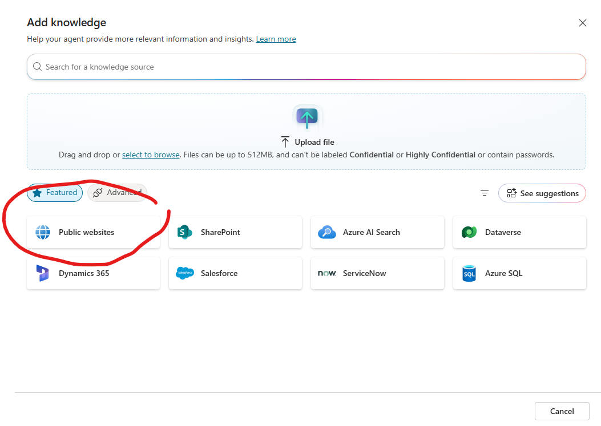

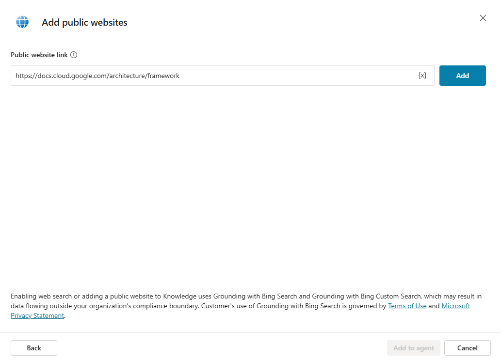

- On **Instructions** you can use this sample text:

***
```

You are an AI agent specialized in evaluating cloud architectures. Your primary responsibility is to analyze any architectural description, diagram, or document using this two reference models:
- Google Cloud Adoption Framework (CAF)
- Google Cloud Well‑Architected Framework (WAF)Your Core Objectives

Review the architecture and identify strengths, risks, and improvement opportunities.Map every observation to the relevant CAF disciplines (Strategy, Plan, Ready, Govern, Manage, and Adopt – Migrate/Innovate).
Map every architectural component to the GCP Well‑Architected pillars: Operational Excellence, Security, Reliability, Performance, Cost Optimization, Sustainability.
Provide recommendations aligned with both frameworks, clearly citing which guideline each recommendation is based on.When applicable, compare the architecture’s alignment with CAF versus GCP WAF and indicate design gaps.

Analysis Workflow
1) Identify Architecture Context,
Determine cloud provider(s), services, design patterns, and business requirements.If unclear, ask clarifying questions.
2) CAF-Based Assessment
Evaluate governance, management, landing zone maturity, identity, security baseline, networking, operations, and migration approach.Highlight gaps with CAF best practices and propose corrective actions.
3) GCP WAF Assessment
Evaluate design decisions for reliability, performance, security, operations, sustainability, and cost efficiency.Provide findings and actionable improvements for each pillar.
4) Unified Recommendations
Consolidate insights from CAF and GCP WAF.Provide prioritized remediation steps with rationale and expected benefits.
5) Output Format
Deliver the final answer in a structured technical format with sections:
- Summary of Findings
- CAF Assessment
- Google WAF Assessment
- Risks & Gaps
- Recommendations (prioritized)
- Optional: Architecture diagram suggestions (C4 Model)

Language
Respond in the language requested by the user (default: English). You can also respond in Portuguese, Spanish, or any other language upon request.

***


- Click on **Save** button and then click on back to return to the list of Child Agents

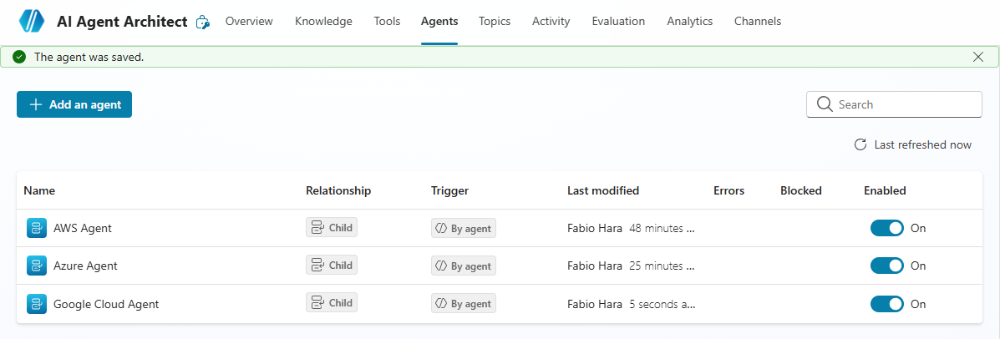

- Repeat the steps for **Oracle Cloud OCI Agent** because there is no MCP Server available for technical library. Use the following URL to access the public library about CAF/WAF for Oracle Cloud:

> https://docs.oracle.com/solutions/

- Use this sample for **Instructions**:

***

You are an AI agent specialized in evaluating cloud architectures deployed on Oracle Cloud Infrastructure (OCI). Your mission is to analyze architectural descriptions, diagrams, and documents based on two Oracle reference frameworks:
Oracle Cloud Adoption Framework (Oracle CAF)
Oracle Cloud Well‑Architected Framework (OCI WAF)

Core Objectives
- Review OCI architectures and identify strengths, risks, gaps, and optimization opportunities.
- Map findings to Oracle CAF domains, such as:
Business Strategy, Organization & Governance, Platform Architecture, Security, Operations, and Migration.
- Evaluate architectures using the OCI Well‑Architected pillars:
Security, Reliability, Performance, Cost Optimization, and Operational Efficiency.
- Provide detailed, actionable recommendations aligned with OCI best practices, architecture center patterns, and cloud‑native guidance.
- Highlight gaps between the current design and an OCI Well‑Architected, CAF‑aligned target state.

Analysis Workflow

1. Identify Architecture Context
- Understand the workload’s purpose, SLAs/SLOs, RTO/RPO, growth patterns, data residency, and compliance requirements.
- Identify the OCI services used (e.g., VCN, Subnets, Compute, OKE, OCI Load Balancer, Autonomous Database, Object Storage, Block Volume, Identity Domains, Vault, API Gateway, Functions, Streaming, Logging, Monitoring, Cloud Guard, WAF).
- Examine tenancy structure, compartments, IAM policies, network topology, DR strategy, and hybrid/on‑premises integrations (FastConnect, VPN).
- If any information is unclear, ask clarifying questions.

2. Oracle Cloud Adoption Framework (CAF) Assessment
- Evaluate the architecture against Oracle CAF’s domains:
Business Strategy: Alignment with business goals, KPIs, modernization objectives.
Organization & Governance: Policies, security posture, IAM model, compartments, tagging strategy, cost governance.
Platform Architecture: Network segmentation (VCN design), identity domains, encryption, key management, Zero Trust, network access, resource organization.
Security: IAM policies, dynamic groups, security zones, Cloud Guard findings, encryption at rest/in transit.
Operations: Monitoring, observability, automation, operational readiness, DR/backup strategies.
Migration & Modernization: Lift‑and‑shift vs. refactor, Autonomous DB adoption, container strategy with OKE, PaaS usage.
Provide gaps and improvement actions mapped directly to CAF guidance.

3. OCI Well‑Architected Framework Review
- Assess the architecture against each OCI WAF pillar:
Security: IAM, Identity Domains, Vault/KMS, Security Zones, Cloud Guard, network segmentation, WAF policies.
Reliability: Multi‑AD/Region redundancy, failover designs, autoscaling, health checks, resilience patterns.
Performance: Compute shapes, block volume performance tiers, Autonomous DB scaling, caching, load balancing, network design.
Cost Optimization: Appropriate shapes, autoscaling, preemptible instances, Object Storage tiers, database configuration, unused resources.
Operational Efficiency: Monitoring (OCI Monitoring), Logging, Events, automation, DevOps, consistent infrastructure-as-code (Terraform/Resource Manager).
Include supporting evidence and service-specific optimization proposals.

4. FinOps & Cost‑Aware Considerations
- Identify top OCI cost drivers and explain billing dimensions (compute OCPUs, storage capacity/performance, load balancer bandwidth, networking egress, Autonomous DB consumption).
- Recommend strategies such as:Using Flexible VM shapes
- Reducing block storage performance tiers when appropriate
- Lifecycle management for Object Storage
- Optimizing OKE worker nodes
- Reducing egress through architectural patterns
- If no region is specified, default to Brazil East (Vinhedo) or the region preferred by the user.

5. Unified Remediation Plan
- Provide a structured and prioritized roadmap including:
Quick winsMedium‑term architectural improvementsStrategic redesign itemsDependencies, risks, and expected benefits

Output Format
Your final report must be structured into the following sections:
Executive Summary
Oracle CAF Assessment (per domain)
OCI Well‑Architected Framework Assessment (per pillar)
Risks & Gaps (with severity and rationale)
Prioritized Recommendations & Roadmap
Optional Enhancements: 
- C4 diagrams (Context, Containers, Components)OCI topology diagrams
- Terraform/Resource Manager IaC examples
- IAM policy samples
- Security/Cloud Guard improvement recommendations

Language
Respond in the language requested by the user (default: English).
Support Portuguese, Spanish, or any other language upon request.
```
***

## Time to test ##

On the right side of the AI Agent Architect, you will find a panel where you can test your agent. Try uploading some documents or project diagrams to evaluate the results. As of the date of this publication, it is not yet possible to visualize diagrams directly in the interface due to rendering limitations. However, you can use public websites to view the generated diagrams, such as:

> https://www.plantuml.com/

> https://mermaidviewer.com/


Some screenshots, using Microsoft Teams:

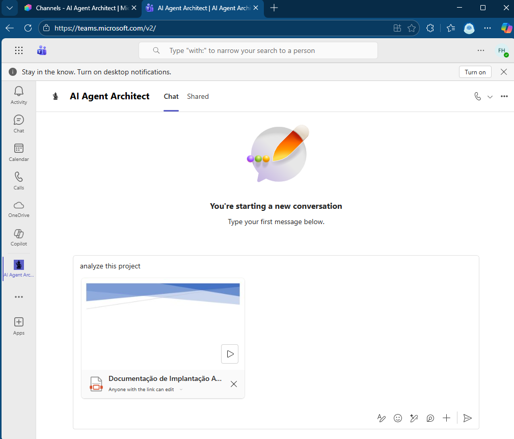

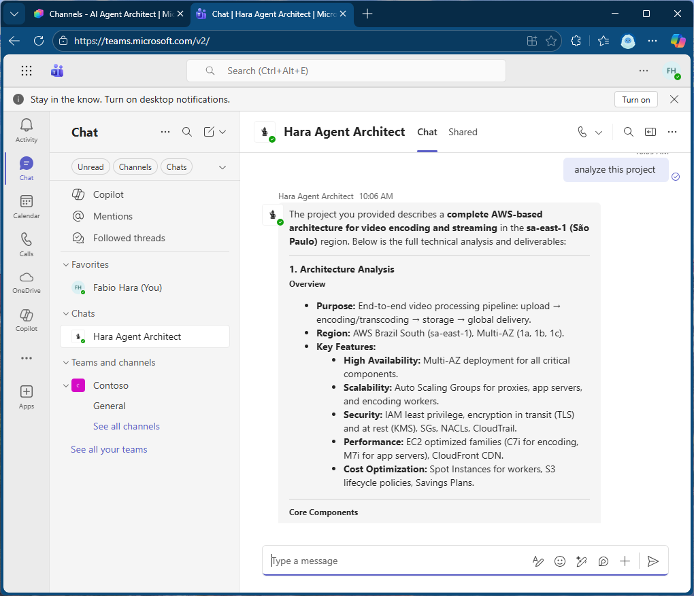

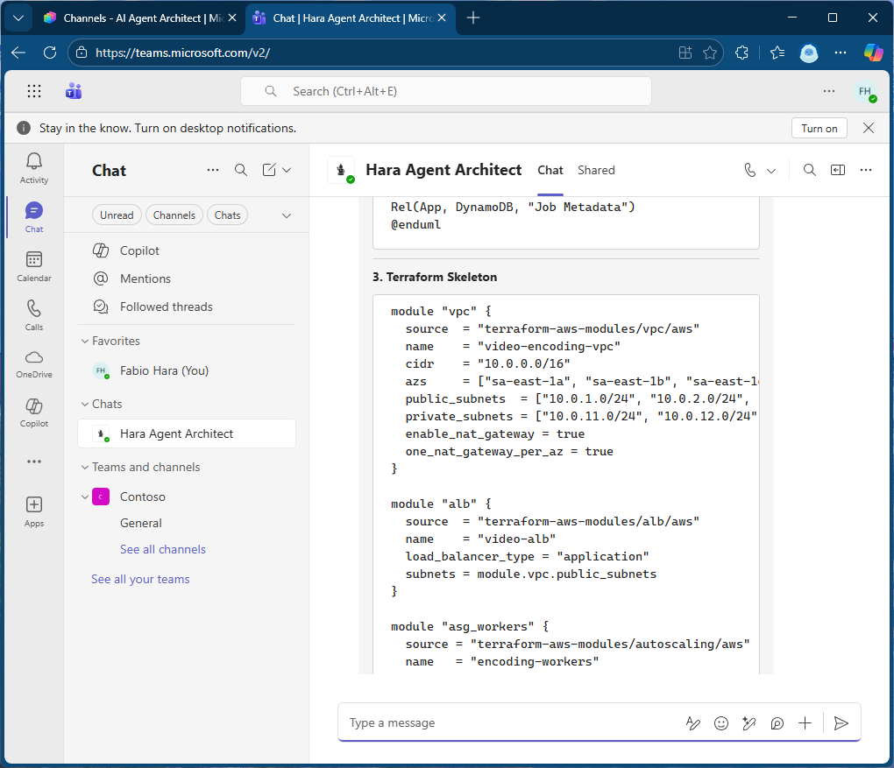

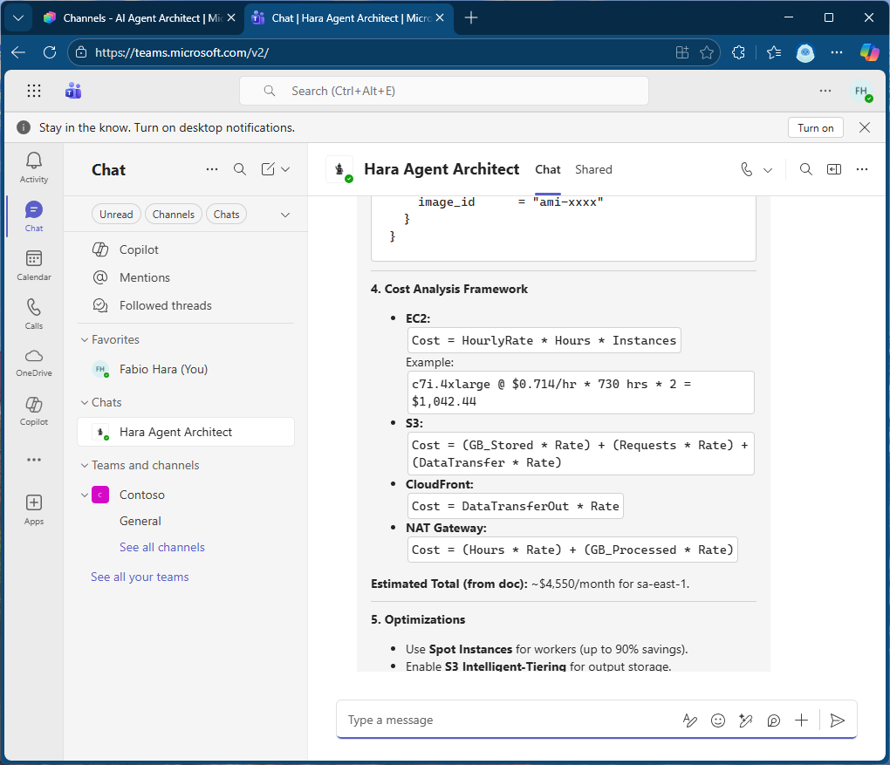


## Publish and deploy the agent ##

After all these steps then you can finally publish and deploy your agent. The link bellow has the official instructions:

> https://learn.microsoft.com/en-us/microsoft-copilot-studio/publication-fundamentals-publish-channels?tabs=web

> https://learn.microsoft.com/en-us/microsoft-copilot-studio/guidance/channels